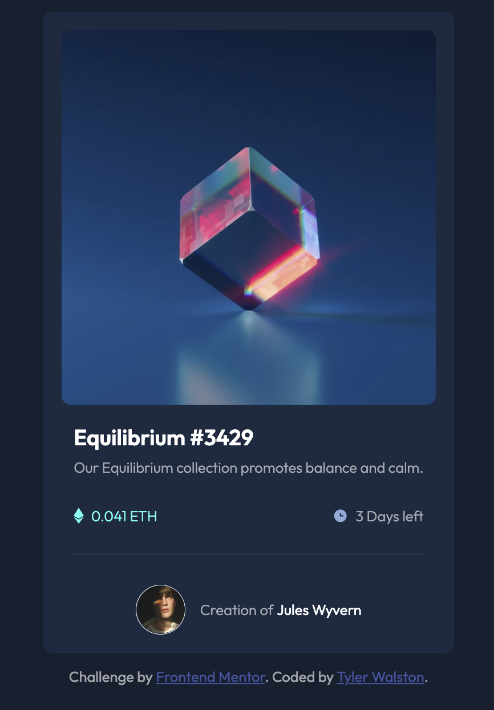

# Frontend Mentor - NFT preview card component solution

This is a solution to the [NFT preview card component challenge on Frontend Mentor](https://www.frontendmentor.io/challenges/nft-preview-card-component-SbdUL_w0U). Frontend Mentor challenges help you improve your coding skills by building realistic projects. 

## Table of contents

- [Overview](#overview)
  - [The challenge](#the-challenge)
  - [Screenshot](#screenshot)
  - [Links](#links)
- [My process](#my-process)
  - [Built with](#built-with)
  - [What I learned](#what-i-learned)
  - [Continued development](#continued-development)
  - [Useful resources](#useful-resources)
- [Author](#author)
- [Acknowledgments](#acknowledgments)

## Overview

This is a solution to the [NFT preview card component challenge on Frontend Mentor](https://www.frontendmentor.io/challenges/nft-preview-card-component-SbdUL_w0U). Frontend Mentor challenges help you improve your coding skills by building realistic projects. 

### The challenge

Users should be able to:

- View the optimal layout depending on their device's screen size
- See hover states for interactive elements

### Screenshot

### Links

- Solution URL: https://github.com/tylerwalston/nft-preview-card-component-main
- Live Site URL: https://cool-crepe-24bf32.netlify.app/

## My process

### Built with

- Semantic HTML5 markup
- CSS custom properties
- Flexbox
- Mobile-first workflow

### What I learned

Reinforcing my understanding of CSS positioning, especially 'responsive-first.' Also, using unordered lists within articles was much easier than having to style extra divs for the for the price and time icon/text components.   

### Continued development

I need a few more of these under my belt, and to dive deeper into understanding media queries.

### Useful resources

- [Codepen](https://www.codepen.io) - I just searched this challenge's name and looked through how others have thought through this challenge. 

## Author

- Website - [Tyler Walston](https://github.com/tylerwalston)
- Twitter - [@_tylerwalston](https://www.twitter.com/_tylerwalston)

